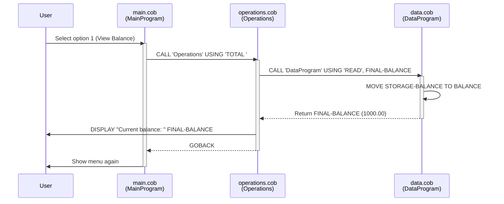
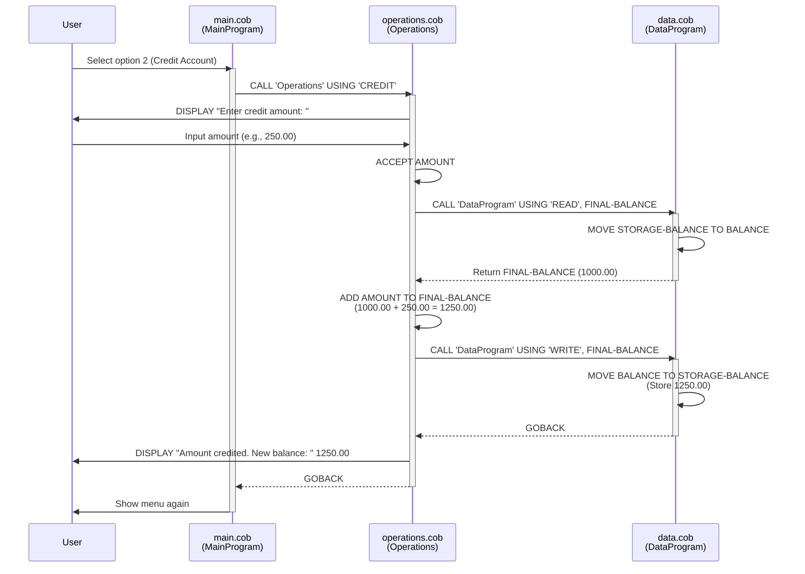
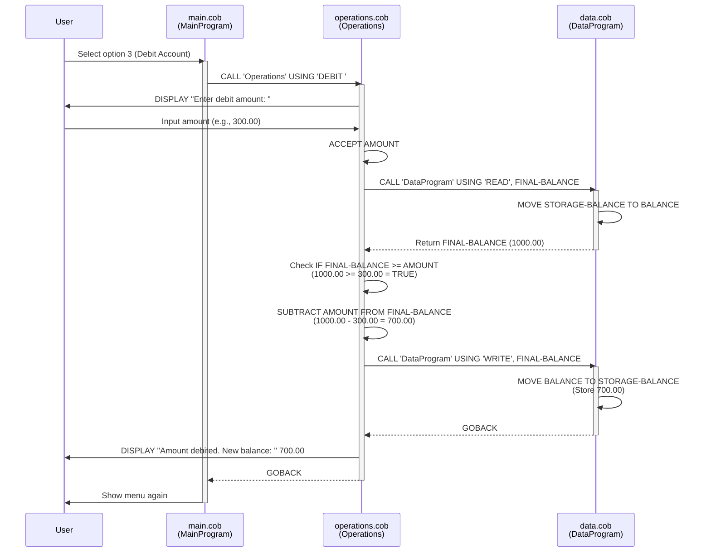
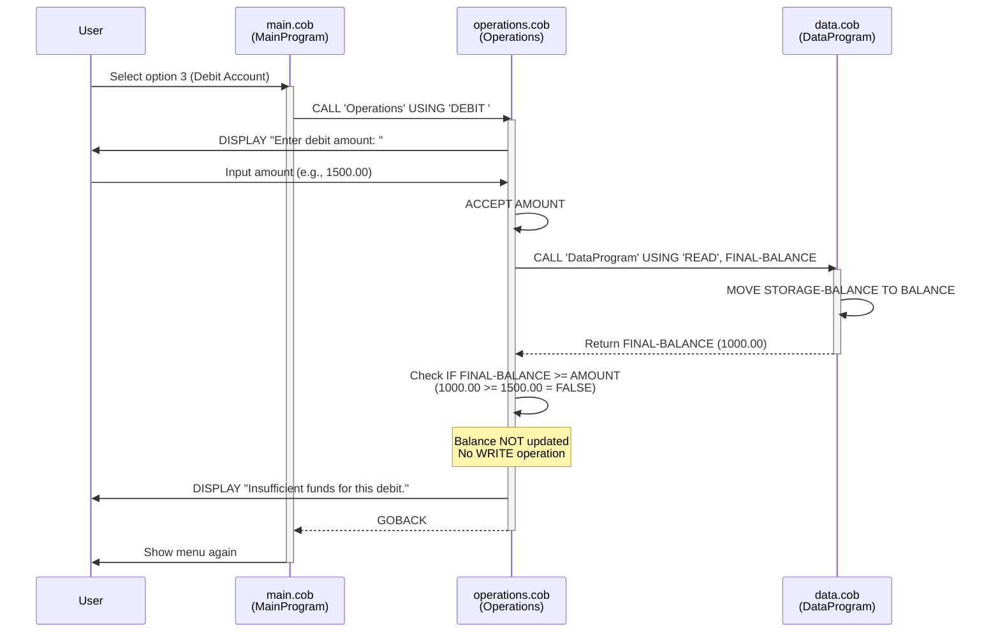
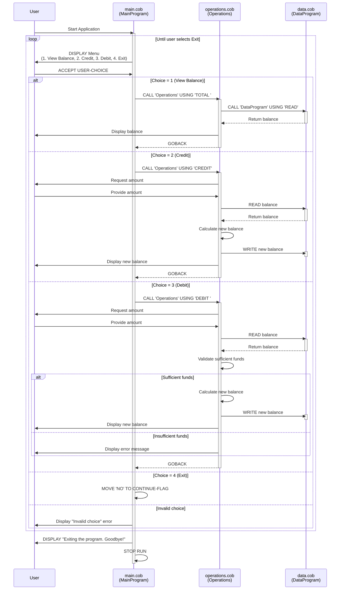

# COBOL Account Management System Documentation

## Overview

This COBOL application implements a simple student account management system that allows users to view balances, credit accounts, and debit accounts. The system is composed of three modular COBOL programs that work together to provide a complete account management solution.

## Architecture

The system follows a modular design pattern with three distinct components:

```
main.cob (UI Layer)
    ↓
operations.cob (Business Logic Layer)
    ↓
data.cob (Data Access Layer)
```

---

## File Documentation

### 1. main.cob - Main Program (Entry Point)

**Program ID:** `MainProgram`

**Purpose:**  
Serves as the main entry point and user interface for the Account Management System. Provides a menu-driven interface for students to interact with their accounts.

**Key Functions:**
- **MAIN-LOGIC:** Main control loop that displays the menu and processes user choices until exit
  - Displays a numbered menu with 4 options
  - Accepts user input (1-4)
  - Routes requests to the appropriate operation
  - Validates user input and handles invalid choices

**Menu Options:**
1. View Balance - Calls Operations with 'TOTAL ' parameter
2. Credit Account - Calls Operations with 'CREDIT' parameter
3. Debit Account - Calls Operations with 'DEBIT ' parameter
4. Exit - Terminates the program

**Data Elements:**
- `USER-CHOICE` (PIC 9): Stores the user's menu selection
- `CONTINUE-FLAG` (PIC X(3)): Controls the main loop ('YES' or 'NO')

**Program Flow:**
1. Display menu options
2. Accept user choice
3. Evaluate choice and call appropriate operation
4. Repeat until user selects exit
5. Display goodbye message and terminate

---

### 2. operations.cob - Business Logic Layer

**Program ID:** `Operations`

**Purpose:**  
Implements the core business logic for account operations. Acts as an intermediary between the user interface and data storage, enforcing business rules and performing calculations.

**Key Functions:**

#### TOTAL Operation
- **Input:** 'TOTAL ' operation type
- **Process:** Calls DataProgram to read current balance
- **Output:** Displays current balance to user

#### CREDIT Operation
- **Input:** 'CREDIT' operation type
- **Process:**
  1. Prompts user for credit amount
  2. Reads current balance from DataProgram
  3. Adds credit amount to balance
  4. Writes updated balance back to DataProgram
- **Output:** Displays new balance after credit

#### DEBIT Operation
- **Input:** 'DEBIT ' operation type
- **Process:**
  1. Prompts user for debit amount
  2. Reads current balance from DataProgram
  3. Validates sufficient funds are available
  4. Subtracts debit amount from balance (if funds available)
  5. Writes updated balance back to DataProgram
- **Output:** Displays new balance or insufficient funds message

**Data Elements:**
- `OPERATION-TYPE` (PIC X(6)): Stores the operation to perform
- `AMOUNT` (PIC 9(6)V99): Stores the credit/debit amount entered by user
- `FINAL-BALANCE` (PIC 9(6)V99): Working balance variable (initialized to 1000.00)

**Linkage Section:**
- `PASSED-OPERATION` (PIC X(6)): Receives operation type from calling program

---

### 3. data.cob - Data Access Layer

**Program ID:** `DataProgram`

**Purpose:**  
Manages the persistent storage of account balance data. Provides a simple data access interface with READ and WRITE operations to abstract the storage mechanism.

**Key Functions:**

#### READ Operation
- **Input:** 'READ' operation type
- **Process:** Copies stored balance to output parameter
- **Output:** Returns current balance via LINKAGE parameter

#### WRITE Operation
- **Input:** 'WRITE' operation type and new balance value
- **Process:** Updates stored balance with new value
- **Output:** Balance persisted in storage

**Data Elements:**
- `STORAGE-BALANCE` (PIC 9(6)V99): The persistent account balance (initialized to 1000.00)
- `OPERATION-TYPE` (PIC X(6)): Stores the requested operation

**Linkage Section:**
- `PASSED-OPERATION` (PIC X(6)): Receives operation type (READ/WRITE)
- `BALANCE` (PIC 9(6)V99): Input/Output parameter for balance values

---

## Business Rules - Student Accounts

### 1. Initial Balance
- **Rule:** All student accounts start with an initial balance of **$1,000.00**
- **Implementation:** Hardcoded in `STORAGE-BALANCE` in data.cob
- **Rationale:** Provides students with a starting balance for account operations

### 2. Balance Limits
- **Rule:** Account balance can range from **$0.00 to $999,999.99**
- **Implementation:** Enforced by PIC 9(6)V99 data type (6 digits + 2 decimal places)
- **Rationale:** Ensures balance values fit within defined numeric constraints

### 3. Insufficient Funds Protection
- **Rule:** Debit operations are **not allowed** if the requested amount exceeds the current balance
- **Implementation:** 
  ```cobol
  IF FINAL-BALANCE >= AMOUNT
      SUBTRACT AMOUNT FROM FINAL-BALANCE
  ELSE
      DISPLAY "Insufficient funds for this debit."
  ```
- **Rationale:** Prevents negative balances and overdrafts

### 4. Transaction Amount Limits
- **Rule:** Credit and debit amounts can be up to **$999,999.99**
- **Implementation:** Enforced by PIC 9(6)V99 data type for AMOUNT variable
- **Rationale:** Matches the balance storage capacity

### 5. Precision Requirements
- **Rule:** All monetary values are stored with **2 decimal places** (cents precision)
- **Implementation:** V99 in all balance/amount PIC clauses
- **Rationale:** Standard accounting practice for currency representation

### 6. Data Persistence
- **Rule:** Balance changes are immediately persisted after each transaction
- **Implementation:** operations.cob calls DataProgram with 'WRITE' after computing new balance
- **Rationale:** Ensures data consistency and prevents loss of transaction data

### 7. Operation Atomicity
- **Rule:** Each operation (credit/debit) is completed fully or not at all
- **Implementation:** Read → Calculate → Write sequence in operations.cob
- **Rationale:** Maintains data integrity during transactions

---

## Data Flow Examples

### View Balance Flow
```
User → main.cob (choice: 1)
    → operations.cob ('TOTAL ')
        → data.cob ('READ')
        ← returns balance
    ← displays balance
```

### Credit Account Flow
```
User → main.cob (choice: 2)
    → operations.cob ('CREDIT')
        → prompts for amount
        → data.cob ('READ') - get current balance
        → calculates new balance
        → data.cob ('WRITE') - save new balance
        ← displays new balance
```

### Debit Account Flow
```
User → main.cob (choice: 3)
    → operations.cob ('DEBIT ')
        → prompts for amount
        → data.cob ('READ') - get current balance
        → validates sufficient funds
        → if OK: calculates new balance
        → if OK: data.cob ('WRITE') - save new balance
        ← displays result (new balance or error)
```

---

## Technical Notes

### Program Communication
- Programs communicate using COBOL `CALL` statements with `USING` parameters
- Operation types are passed as 6-character fixed-length strings
- Balance values are passed by reference through the LINKAGE SECTION

### Data Types
- **PIC 9**: Single numeric digit
- **PIC X(n)**: Fixed-length alphanumeric string of n characters
- **PIC 9(6)V99**: Numeric value with 6 integer digits and 2 decimal places (implied decimal point)

### Operation Type Codes
- `'TOTAL '`: View current balance (note trailing space for 6-char length)
- `'CREDIT'`: Add funds to account
- `'DEBIT '`: Remove funds from account (note trailing space)
- `'READ'`: Internal - retrieve balance from storage
- `'WRITE'`: Internal - update balance in storage

---

## Modernization Considerations

When modernizing this legacy COBOL system, consider:

1. **Database Integration:** Replace in-memory balance storage with proper database persistence
2. **Multi-user Support:** Add account identification and concurrent access controls
3. **Transaction History:** Implement logging/audit trail for all operations
4. **Input Validation:** Add more robust validation for monetary amounts
5. **Error Handling:** Implement comprehensive error handling and recovery
6. **Security:** Add authentication, authorization, and encryption for sensitive data
7. **API Integration:** Expose functionality through modern REST/GraphQL APIs
8. **Business Logic Expansion:** Support transfers, interest calculation, account types, etc.

---

## Maintenance History

- Initial implementation: Student Account Management System
- Current version: Legacy COBOL implementation with basic operations

---

## Sequence Diagrams

### View Balance Operation



### Credit Account Operation



### Debit Account Operation (Sufficient Funds)



### Debit Account Operation (Insufficient Funds)



### Complete Application Flow



---

*Last Updated: February 22, 2026*
